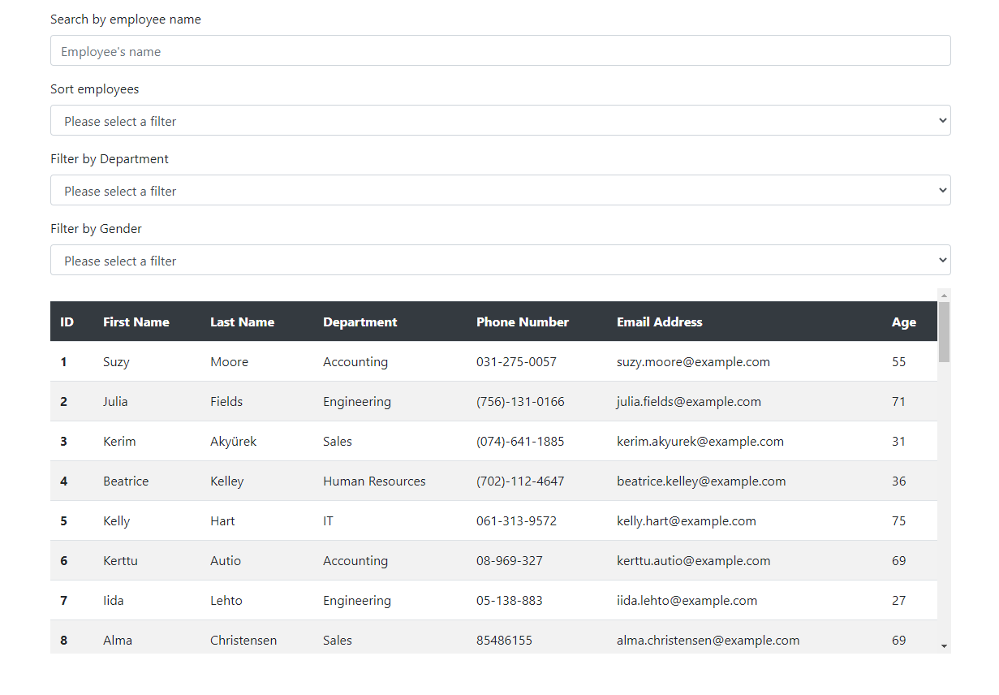
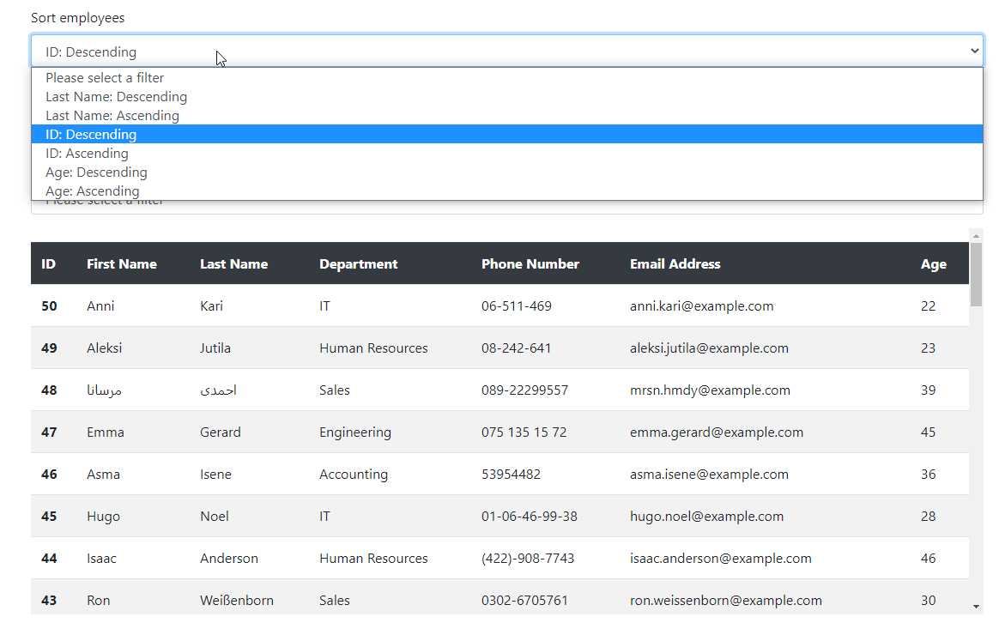
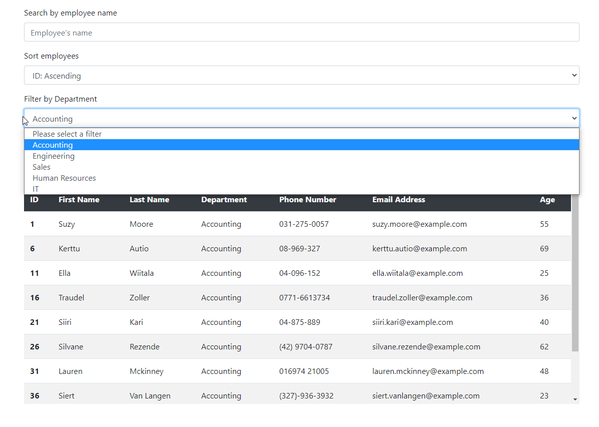
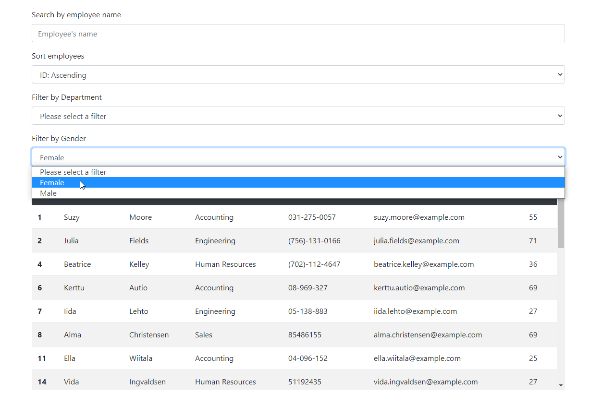
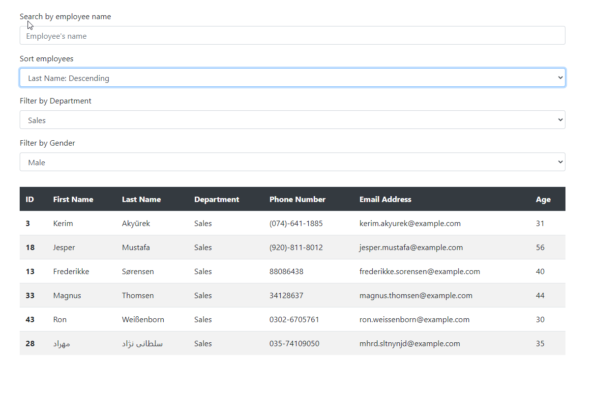

# Employee Directory

## Description

This is a Basic employee directory that I have made using React.js.  

The directory has been populated with false names, emails, and phone numbers, and with departments and employee IDs that I have provided.  

The user can search for employees by name, or sort using ID, age, and last name alphabetically. The user can also filter employees using department and gender. All sort and filter capabilities can work together, so you can theoretically seach for all females in accounting with the name "Suzy" and have acurate results (if such a person exits).  

## Development

The app was made entirely with React.js. I Decided to use the method known as "prop drilling" to transfer data from the search bar component (which defines state), all the way to the table content component, which displays the data. 

The website uses bootstrap as a css framework, and uses Axios to get API data from [randomuser.me](https://randomuser.me/). 

## Future development 

As it is now, the uses of this application are very limited, but I believe it could be serve as a frame to a useful directory app with the following improvements:  
* Database integration  
* Authentication  
* Conversion to a progressive web app

## Links  
[Deployed App (GitHub Pages)](https://jjbidwell.github.io/employee-directory/)
[GitHub Repository](https://github.com/jjbidwell/employee-directory/)

## Screenshots  
  
  
  
  
  
  